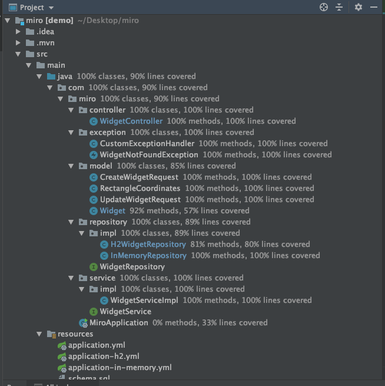

# Miro Widget API

### Summary
This is a small API where basic CRUD operations can be done through Widgets.
Two different repository implementation exist in the service:
 * ConcurrentHashMap
 * H2

Operation results of widgets are same, they do not depend on the storage type.

This app is written with Java 11 & SpringBoot framework.
 
### Build the app & run tests
    $ mvn clean install  -> (with default profile, via in-memory)
    $ mvn clean install -Dspring.profiles.active=in-memory  -> (to run integration tests via in-memory ConcurrentHashMap)
    $ mvn clean install -Dspring.profiles.active=h2 -> (to run integration tests via h2 datasource)

### Run the app with 2 different profiles
This will use ConcurrentHashMap to store widgets:

    $ mvn spring-boot:run
    $ mvn spring-boot:run -Dspring-boot.run.profiles=in-memory

This will use H2 in memory DB to store widgets:
    
    $ mvn spring-boot:run -Dspring-boot.run.profiles=h2

**If profile is not provided, default datasource will be ConcurrentHashMap.**

If you would like to query data in H2, go to http://localhost:8080/h2-console and use these credentials to login:

    username: sa
    password:

As default, the application will start at port 8080.

### Functionalities of API on widgets
* **POST** - **/v1/widgets** -> Create a brand new widget. Mandatory fields: **xIndex**, **yIndex**, **height**, **weight**
* **PUT** - **/v1/widgets** -> Update an existing widget. Mandatory fields: **id**, **xIndex**, **yIndex**, **height**, **weight**
* **DELETE** - **/v1/widgets/{id}** -> Delete an existing widget
* **GET** - **/v1/widgets/{id}** -> Get a widget by id
* **GET** - **/v1/widgets** -> Get widgets. Optional request parameters are **limit**, **x1**, **y1**, **x2**, **y2**. Limit should be between [1-500], **default limit = 10** 
**[x1,y1]** & **[x2,y2]** represents the coordinates(two points) to filter which widgets are located in it.

### Tests
There are both unit test & integration tests written and can be find under **/test**
Here is a test coverage of the service:

